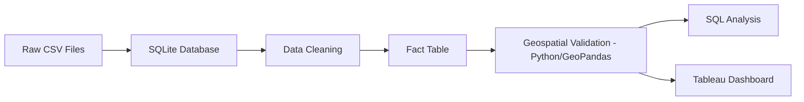

# 🚲 Pedestrian and Cyclist Accidents in Mexico City (2019)

## 📌 Project Overview

This project analyzes traffic accidents involving **pedestrians and cyclists** in **Mexico City during 2019**, using publicly available data from **Datos México**.

The objective was to build an end-to-end Business Intelligence project by extracting, cleaning, transforming, and analyzing accident records before presenting the results in an interactive Tableau dashboard.

This project demonstrates a typical Data Analyst workflow, including data preparation, SQL analysis, geospatial validation, and dashboard development.

---

## 🎯 Objectives

- Merge pedestrian and cyclist accident datasets into a unified fact table.
- Clean and standardize accident information.
- Validate and correct borough (`alcaldía`) assignments using geospatial analysis.
- Perform exploratory and business-oriented SQL analysis.
- Build an interactive dashboard in Tableau.
- Showcase SQL, Python, and Business Intelligence skills for a Data Analyst portfolio.

---

## 📂 Dataset

**Source**

- Datos México (Open Government Data)
- [Portal de Datos Abiertos de la CDMX — Límite de Alcaldías Marco Geoestadístico 2020, INEGI](https://datos.cdmx.gob.mx/dataset/alcaldias)

**Files**

- `ciclistas.csv`
- `peatones.csv`
- `poligonos_alcaldias_cdmx.shp` (+ `.shx`, `.dbf`, `.prj`, `.cpg`)

Both accident datasets were combined into a single fact table named:

```text
fact_accidentes
```

---

## 🏗️ Project Architecture

```text
Raw CSV Files
        │
        ▼
SQLite Database
        │
        ▼
Data Cleaning
        │
        ▼
Fact Table
        │
        ▼
Geospatial Validation (Python / GeoPandas)
        │
        ▼
Business Questions
        │
        ▼
Tableau Dashboard
```

---

## 📁 Repository Structure

```text
Accidentes-CDMX/
│
├── data/
│   ├── raw/
│   │   ├── ciclistas.csv
│   │   └── peatones.csv
│   │
│   ├── external/
│   │   └── alcaldias/
│   │       ├── poligonos_alcaldias_cdmx.shp
│   │       ├── poligonos_alcaldias_cdmx.shx
│   │       ├── poligonos_alcaldias_cdmx.dbf
│   │       ├── poligonos_alcaldias_cdmx.prj
│   │       └── poligonos_alcaldias_cdmx.cpg
│   │
│   └── processed/
│       ├── fact_accidentes2.csv
│       └── fact_accidentes_corregido.csv
│
├── database/
│   ├── accidentes_cdmx.db
│   └── accidentes_cdmx.db-journal
│
├── sql/
│   ├── 01_insert_fact_accidentes.sql
│   ├── 02_businessQuestions.sql
│   ├── 03_cleaning_dia_column.sql
│   └── 04_cleaning_columns.sql
│
├── scripts/
│   └── corregir_alcaldias.py
│
├── Dashboard/
│   └── AccidentesDashboard_CDMX.twb
│
├── images/
│   └── TableauDashborad.png
│
├── README.md
├── LICENSE
└── .gitignore
```

---

## 🛠️ Technologies

- SQLite
- SQL
- Python (GeoPandas, Pandas, Shapely)
- Tableau
- Git
- GitHub
- CSV / Shapefile

---

## ⚙️ SQL Workflow

### 1. Create Fact Table

**Script**

```
01_insert_fact_accidentes.sql
```

This script:

- Creates the `fact_accidentes` table.
- Combines cyclist and pedestrian datasets using `UNION ALL`.
- Adds the `tipo_accidente` field to distinguish between accident types.
- Loads all accident records into the database.

---

### 2. Data Cleaning

**Scripts**

```
03_cleaning_dia_column.sql
04_cleaning_columns.sql
```

Cleaning tasks include:

- Removing leading and trailing spaces.
- Converting text to lowercase.
- Removing Spanish accents.
- Renaming columns for better readability.

Example:

| Original | New |
|----------|-----|
| coordenada | longitud |
| coordena_1 | latitud |

---

### 3. Geospatial Validation of Borough Assignments

**Script**

```
scripts/corregir_alcaldias.py
```

While exploring the Tableau dashboard, some accident points appeared visually located outside their reported borough (`alcaldía`). To investigate and resolve this, a Python script was built using **GeoPandas** to cross-reference each accident's GPS coordinates against the official borough polygons.

**Methodology**

1. Build a `GeoDataFrame` of accident points from `longitud`/`latitud`.
2. Load the official borough shapefile (INEGI Marco Geoestadístico 2020, via Portal de Datos Abiertos CDMX) and reproject both layers to a metric CRS (`EPSG:6372`).
3. Run a **nearest-neighbor spatial join** (`sjoin_nearest`) instead of a strict `within` join, so that points falling just outside a polygon border are still matched to the closest borough rather than dropped.
4. Normalize text on both sides (uppercase, accent removal, punctuation stripping, and a small alias dictionary for abbreviated names like `CUAJIMALPA` → `CUAJIMALPA DE MORELOS`) before comparing the declared borough against the calculated one — this avoids false positives caused purely by formatting differences.
5. Flag records where the declared and calculated boroughs disagree (`discrepancia`), and where the point sits unusually far from any borough polygon (`coordenada_sospechosa`, >500 m).
6. For flagged discrepancies, compute the distance from the point to the border of its assigned borough (`dist_al_borde_m`), to distinguish genuine data-entry errors from accidents that legitimately occurred near a borough boundary.

**Findings**

| Metric | Value |
|---|---|
| Total records processed | 4,657 |
| Suspicious coordinates (>500 m from any borough) | 0 (0.0%) |
| Borough discrepancies (declared ≠ calculated) | 183 (3.9%) |
| Discrepancies within 150 m of a borough boundary | 116 (63.4%) |
| Discrepancies farther than 500 m from any boundary | 67 |

- **No suspicious coordinates were found** — every accident's GPS location falls cleanly within some borough polygon, confirming that the underlying latitude/longitude data is reliable.
- Most discrepancies (63.4%) occur within 150 m of a shared border between two boroughs (e.g. Coyoacán ↔ Tlalpan, Venustiano Carranza ↔ Cuauhtémoc, Álvaro Obregón ↔ Miguel Hidalgo), consistent with the reporting party recording the borough by local knowledge rather than the technical polygon boundary.
- A smaller subset (67 records) shows discrepancies of 500 m up to several kilometers from the assigned borough, which is more consistent with data-entry errors (e.g. the reporting unit's borough rather than the accident location).

**Business rule adopted:** the geometry-derived borough (`alcaldia_final`) always replaces the originally captured value, since GPS coordinates are the most objective source of truth available. The `dist_al_borde_m` column is preserved for the discrepant records so that boundary-adjacent cases remain auditable directly from the corrected fact table, without maintaining a separate file.

---

### 4. SQL Analysis

### Business questions answered include:

Total accident records. *4657*

Top Boroughs(Alcaldía) by Accident Count.

|Rank|Borough|Accident Count|
|---|---|---|
|1|CUAUHTEMOC|920|
|2|IZTAPALAPA|661|
|3|MIGUEL HIDALGO|410|
|4|GUSTAVO A MADERO|407|
|5|COYOACAN|368|

Accidents by month.

Cyclist vs pedestrian accidents.

Total fatalities and injured people.

|Identity|Fatalities|Injuries|
|---|---|---|
|Cyclist|11|730|
|Pedestrian|173|4069|

- Most common injuries.

---

## 📊 Dashboard

The Tableau dashboard includes:

- Interactive map displaying the location of each accident.
- Heatmap analyzing accident patterns by hour and weekday.
- Calendar filter for daily analysis.
- Borough and month filters for dynamic exploration.
- Pie chart comparing pedestrian and cyclist accidents.

> *(Insert dashboard screenshots inside the `/images` folder.)*

---

## 📈 Example Business Questions

Some SQL analyses performed:

- Which borough recorded the highest number of accidents?
- Which months experienced the highest accident frequency?
- How many accidents involved pedestrians versus cyclists?
- What are the most common reported injuries?
- What is the relationship between fatalities and injuries by accident type?
- Which accidents had a mismatched borough assignment, and how many were genuine data errors versus boundary-adjacent cases?

---

## 🔄 ETL Process



---

## 🚀 Reproducing the Project

Clone the repository.

```bash
git clone https://github.com/yourusername/Accidentes-CDMX.git
```

Move into the project.

```bash
cd Accidentes-CDMX
```

Create the SQLite database.

```bash
sqlite3 database/accidentes_cdmx.db
```

Inside SQLite execute:

```sql
.mode csv

.import data/raw/ciclistas.csv ciclistas

.import data/raw/peatones.csv peatones

.read sql/01_insert_fact_accidentes.sql

.read sql/03_cleaning_dia_column.sql

.read sql/04_cleaning_columns.sql

.quit
```

Run the geospatial validation script to generate the corrected fact table:

```bash
pip install geopandas pandas
python scripts/corregir_alcaldias.py
```

---

## 💼 Skills Demonstrated

- SQL
- Python (GeoPandas)
- Geospatial Analysis / Spatial Joins
- Data Cleaning
- Data Transformation
- ETL
- Relational Databases
- Business Intelligence
- Data Visualization
- Exploratory Data Analysis
- Dashboard Design
- Git & GitHub

---
## 👨‍💻 Author

**Ar Sullivan Santana**
Data Analyst

GitHub Portfolio

---

## 📄 License

This project is licensed under the MIT License.