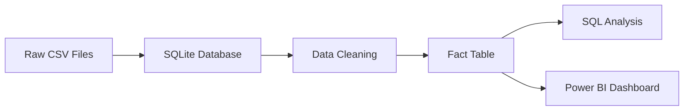

# 🚲 Pedestrian and Cyclist Accidents in Mexico City (2019)

## 📌 Project Overview

This project analyzes traffic accidents involving **pedestrians and cyclists** in **Mexico City during 2019**, using publicly available data from **Datos México**.

The objective was to build an end-to-end Business Intelligence project by extracting, cleaning, transforming, and analyzing accident records before presenting the results in an interactive Tableau dashboard.

This project demonstrates a typical Data Analyst workflow, including data preparation, SQL analysis, and dashboard development.

---

## 🎯 Objectives

- Merge pedestrian and cyclist accident datasets into a unified fact table.
- Clean and standardize accident information.
- Perform exploratory and business-oriented SQL analysis.
- Build an interactive dashboard in Tableau.
- Showcase SQL and Business Intelligence skills for a Data Analyst portfolio.

---

## 📂 Dataset

**Source**

- Datos México (Open Government Data)

**Files**

- `ciclistas.csv`
- `peatones.csv`

Both datasets were combined into a single fact table named:

```text
fact_accidentes
```

---

## 🏗️ Project Architecture

```text
Raw CSV Files
        │
        ▼
SQLite Database
        │
        ▼
Data Cleaning
        │
        ▼
Fact Table
        │
        ▼
Business Questions
        │
        ▼
Tableau Dashboard
```

---

## 📁 Repository Structure

```text
Accidentes-CDMX/
│
├── data
│   ├── raw/
│   │   ├── ciclistas.csv
│   │   └── peatones.csv
│   │
│   └── processed/
│       └── fact_accidentes.csv
│
├── database/
│   └── accidentes_cdmx.db
│
├── sql/
│   ├── 01_insert_fact_accidentes.sql
│   ├── 02_businessQuestions.sql
│   ├── 03_cleaning_dia_column.sql
│   └── 04_cleaning_columns.sql
│
├── powerbi/
│   └── AccidentesDashboard_CDMX.twb
│
├── images/
│   ├── TableauDashborad.png
│   ├── map.png
│   └── model.png
│
├── README.md
├── LICENSE
└── .gitignore
```

---

## 🛠️ Technologies

- SQLite
- SQL
- Tableau
- Git
- GitHub
- CSV Files

---

## ⚙️ SQL Workflow

### 1. Create Fact Table

**Script**

```
01_insert_fact_accidentes.sql
```

This script:

- Creates the `fact_accidentes` table.
- Combines cyclist and pedestrian datasets using `UNION ALL`.
- Adds the `tipo_accidente` field to distinguish between accident types.
- Loads all accident records into the database.

---

### 2. Data Cleaning

**Scripts**

```
03_cleaning_dia_column.sql
04_cleaning_columns.sql
```

Cleaning tasks include:

- Removing leading and trailing spaces.
- Converting text to lowercase.
- Removing Spanish accents.
- Renaming columns for better readability.

Example:

| Original | New |
|----------|-----|
| coordenada | longitud |
| coordena_1 | latitud |

---

### 3. SQL Analysis

### Business questions answered include:

Total accident records. *4657*

Top Boroughs(Alcaldía) by Accident Count.

|Rank|Borough|Accident Count|
|---|---|---|
|1|CUAUHTEMOC|920|
|2|IZTAPALAPA|661|
|3|MIGUEL HIDALGO|410|
|4|GUSTAVO A MADERO|407|
|5|COYOACAN|368|

Accidents by month.

Cyclist vs pedestrian accidents.

|Identity|Fatalities|Injuries|
|---|---|---|
|Cyclist|11|730|
|Pedestrian|173|4069|

- Most common injuries.
- Total fatalities.
- Total injured people.

---

## 📊 Dashboard

The Power BI dashboard includes:

- KPI cards
- Accident trend over time
- Accidents by borough
- Interactive map
- Cyclist vs pedestrian comparison
- Fatalities vs injuries
- Interactive slicers

Example:

```
Total Accidents
Total Fatalities
Total Injuries

Accidents by Borough

Monthly Trend

Accident Map

Cyclist vs Pedestrian Distribution
```

> *(Insert dashboard screenshots inside the `/images` folder.)*

---

## 📈 Example Business Questions

Some SQL analyses performed:

- Which borough recorded the highest number of accidents?
- Which months experienced the highest accident frequency?
- How many accidents involved pedestrians versus cyclists?
- What are the most common reported injuries?
- What is the relationship between fatalities and injuries by accident type?

---

## 🔄 ETL Process



---

## 🚀 Reproducing the Project

Clone the repository.

```bash
git clone https://github.com/yourusername/Accidentes-CDMX.git
```

Move into the project.

```bash
cd Accidentes-CDMX
```

Create the SQLite database.

```bash
sqlite3 database/accidentes_cdmx.db
```

Inside SQLite execute:

```sql
.mode csv

.import data/raw/ciclistas.csv ciclistas

.import data/raw/peatones.csv peatones

.read sql/01_insert_fact_accidentes.sql

.read sql/03_cleaning_dia_column.sql

.read sql/04_cleaning_columns.sql

.quit
```

---

## 💼 Skills Demonstrated

- SQL
- Data Cleaning
- Data Transformation
- ETL
- Relational Databases
- Business Intelligence
- Power BI
- Data Visualization
- Exploratory Data Analysis
- Dashboard Design
- Git & GitHub

---
## 👨‍💻 Author

**Ar Sullivan Santana**
Data Analyst

GitHub Portfolio

---

## 📄 License

This project is licensed under the MIT License.
